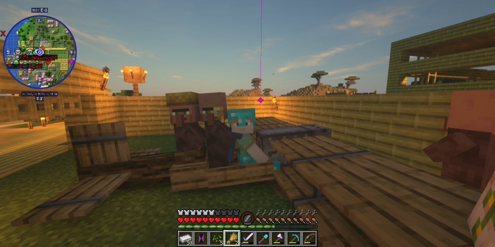
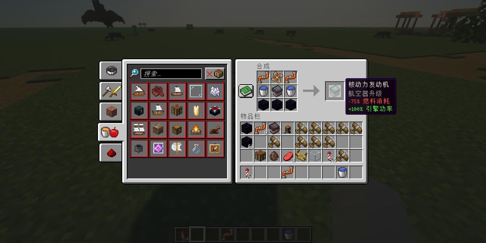

# 沉浸式飞机的修改版，使双翼机可以坐三个人，并且对引擎参数及合成表有所调整

无论是在单人游戏还是服务器中，可乘坐三个人的双翼机都会有更高的可玩性，例如在村庄和村民交易所之间运输村民，以及将远处的罕见生物运回家园以方便繁殖

将经济型发动机更改为核动力发动机。因为在实际的生存服务器中，可以通过自动化竹子工厂生产大量的竹块，玩家并不希望通过牺牲性能来节省燃料

经测试，双翼机在装满三个发动机之后，速度可以达到40米每秒，略高于烟花鞘翅的速度，更接近冰上划船的速度。强大的引擎动力使得飞机可以垂直爬升。
